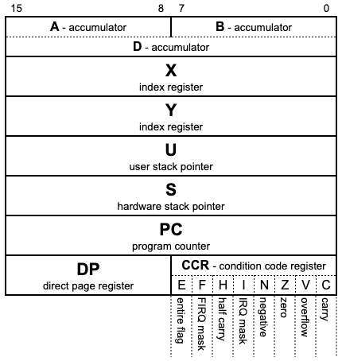

# Turbo9 - A Compact & Efficient Pipelined 6809 Microprocessor IP

### Soft release v0.9 - This repository is still under construction!

----------------------------------------

## Overview
* [What is the Turbo9?](#what-is-the-turbo9)   
* [What are the target applications?](#what-are-the-target-applications)
* [Why use the 6809 instruction set? Why not RISC?](#why-use-the-6809-instruction-set-why-not-risc)
* [But wait 6809 is CISC and CISC is bad!](#but-wait-6809-is-cisc-and-cisc-is-bad)

## The Basics
* [Key Features](#key-features) 
* [Directory Structure](#directory-structure)
* [Current Status](#current-status)
* [Team Members](#team-members)
* [Contact](#contact)

----------------------------------------

## What is the Turbo9?
The Turbo9 is a pipelined microprocessor IP written in Verilog that executes a superset of the Motorola 6809 instruction set. It is a new modern microarchitecture with 16-bit internal datapaths that balances high performance vs small area / low power. The Turbo9R with a 16-bit memory interface achieves 0.69 DMIPS/MHz which is 3.8 times faster than Motorola's original 8-bit MC6809 implementation. It is an active graduate research project at the [Department of Electrical & Computer Engineering](http://www.ece.ufl.edu) at the [University of Florida](http://www.ufl.edu)

   

----------------------------------------

## What are the target applications?
The target applications are SoC sub-blocks or small mixed-signal ASICs that require a compact and efficient microprocessor for programmable high-level control. There are many 32 or 64-bit  RISC-V or ARM cores that try to fill this niche, but prove to be inefficient solutions given many of these applications only require 16-bit precision.

----------------------------------------

## Why use the 6809 instruction set? Why not RISC?
Current industry trends are to adapt 32-bit RISC IP for microcontroller use, however their large 32x32 register files and loosely encoded instructions limit their absolute minimum footprint. So with the goal of a creating a performance _and_ _compact_ microprocessor IP, we need an 16-bit instruction set architecture (ISA). Also, we want an architecture that is capable of running C code effectively. Given these requirements, the Motorola 6809 ISA stands out with its minimal number of registers (shown below), orthogonal instruction set, and powerful indexed and indirect addressing modes that map well to C concepts, such as arrays and pointers. 

----------------------------------------

## But wait 6809 is CISC and CISC is bad!
The 6809 was designed before the definition of RISC and therefore retroactively is classed as a CISC processor. However, the instruction set is actually simpler than many RISC ISAs. The main rule that 6809 instruction set breaks that it is not a "load-store" architecture. It is a simple accumulator architecture where one of its operands is memory. However, the instruction set is very elegant and well thought-through. This presents the challenge of pipelining a CISC processor while remaining as small as possible and attempting to rival performance levels of RISC implementations. To do this, the Turbo9 implements a novel CISC to RISC micro-op decode stage (shown below). 

----------------------------------------

## Key Features
* **Executes a Superset of the  Motorola 6809 Instruction Set**
  - Compatible with existing Comp

* Pipelined micro-architecture
  - Instruction prefetch stage
  - Decode stage (CISC to RISC micro-op translation)
  - Single/Multi-cycle execute stage

* Pipelined Wishbone bus
  - Public domain industry standard
  - Internal separate Program Bus & Data Bus
  - External shared Program/Data Bus

* Custom uRTL microcode assembler
  - written in C
  - macro based assembler
  - Verilog output
  - Statistics output
  - Decode table output

----------------------------------------

## Presentations

- [**Turbo9 - Pipelined 6809 - Overview & uRTL Presentation**](https://www.youtube.com/watch?v=LPJ4IFz4fjE&pp=ygUGdHVyYm85)
- [**Turbo9 - Pipelined 6809 - Benchmarking & Performance**](https://www.youtube.com/watch?v=8ScT86RKopQ)
- [**Turbo9 - Pipelined 6809 - Verification & Design Update**](https://www.youtube.com/watch?v=eTlfH86KUog)
- [**Turbo9 - Pipelined 6809 - Introduction & Overview**](https://www.youtube.com/watch?v=6QfXNfrj19Y)

----------------------------------------

## Publications

- [Kevin Phillipson's Master's Thesis - **A Compact and Efficient Microprocessor IP for SOC Sub-Blocks and Mixed-Signal ASICs**](https://ufdc.ufl.edu/UFE0058740/00001/pdf)

----------------------------------------

## Directory structure
|                               |                                             |                                       |
|-------------------------------|---------------------------------------------|---------------------------------------|
| [asm/](asm/)                  |                                             | Assembly code for the Turbo9          |
| [docs/](docs/)                |                                             | Documents                             |
|                               | [images/](c_code/images/)                   | Images                                |
| [c_code/](c_code/)            |                                             | C code for the Turbo9                 |
|                               | [build_gcc/](c_code/build_gcc/)             | build directory for GCC               |
|                               | [build_vbcc/](c_code/build_vbcc/)           | build directory for VBCC              |
|                               | [byte_sieve_src/](c_code/byte_sieve_src/)   | BYTE Sieve source                     |
|                               | [dhrystone_src/](c_code/dhrystone_src/)     | Dhrystone source                      |
|                               | [hello_world_src/](c_code/hello_world_src/) | Hello World source                    |
|                               | [lib_gcc/](c_code/lib_gcc/)                 | Library for GCC                       |
|                               | [lib_vbcc/](c_code/lib_vbcc/)               | Library for VBCC                      |
| [fpga/](fpga/)                |                                             | FPGA project directory                |
|                               | [bit_files/](fpga/bit_files/)               | .bit files for Arty A7-100T           |
| [regress/](regress/)          |                                             | Nightly regression run directory      |
| [rtl/](rtl/)                  |                                             | Verilog RTL for micro-architecture    |
|                               | [urtl/](c_code/urtl/)                       | uRTL microcode for micro-architecture |
| [sim/](sim/)                  |                                             | Simulation run directory              |
| [tb/](tb/)                    |                                             | Testbench & Testcases                 |
| [urtl_asm_src/](urtl_asm_src) |                                             | uRTL microcode assembler source code  |
|                               |                                             |                                       |

----------------------------------------

## Third-Party Tools

- [Linux environment with C shell, bash, gcc, and make](https://ubuntu-mate.org)
  * A Linux environment is required for running and building Turbo9 scripts and tools
  * We recommend Ubuntu MATE ;-)

- [Icarus Verilog](https://github.com/steveicarus/iverilog)
  * Required for running testbench

- [GTKWave](https://gtkwave.sourceforge.net)
  * Required for viewing waveforms from Icarus Verilog

- [vbcc - portable ISO C compiler]( http://www.compilers.de/vbcc.html)
  * An excellent C compiler for the 6809 / Turbo9
  * makefile and library provided in [c_code/](c_code)

- [gcc6809](https://launchpad.net/~tormodvolden/+archive/ubuntu/m6809)
  * A port of the GCC for the 6809
  * makefile and library provided in [c_code/](c_code/)

- [CMOC 6809 C language cross-compiler](http://perso.b2b2c.ca/~sarrazip/dev/cmoc.html)
  * A very nice C compiler for the 6809

- [LWTOOLS cross-dev tools for Motorola 6809](http://www.lwtools.ca/)
  * An excellent assembler for the 6809
  * Required for several scripts in [asm/](asm/)

----------------------------------------

## Current status
* 99% of instructions work
* Interrupts incomplete
* 98% of testcases complete

### TODO List

* Interrupts
* Implement Turbo9S
* SDIV / SMUL
* fix stim bench
* pipeline bubbles on reset are benign

----------------------------------------

## Team Members
### Kevin Phillipson

- **Project Leader**
- Responsibilities
  + Microarchitecture design
  + RTL & Microcode development
- 15 years of industry experience in ASIC design
- Bachelor's Degree in Electrical Engineering from University of Florida 2008
- Master's Degree in Electrical Engineering from University of Florida in 2022
- Currently pursuing a PhD from University of Florida
- Master's Thesis: _A Compact & Efficient Microprocessor IP for SoC Sub-Blocks and Mixed-Signal ASICs_

### Michael Rywalt

- **Principal Contributor**
- Responsibilities
  + Custom uRTL microcode assembler
  + Verification & Tools
- 15 years of industry experience in ASIC design
- Bachelor's Degree of science in Computer Science and software Engineering from Florida Institute of Technology 2008
- Currently pursuing a Master's Degree in Electrical Engineering from University of Florida
- Master's Thesis: _Verification of a compact & efficient microprocessor IP_

----------------------------------------

## Faculty
### Dr. Greg Stitt

- **Associate Professor**
- NSF Center for Space, High-Performance, and Resilient Computing (SHREC)
- Research interests: Embedded systems with an emphasis in synthesis, compilers, reconfigurable computing, hardware/software co-design
- Website: [www.gstitt.ece.ufl.edu](http://www.gstitt.ece.ufl.edu)

### Dr. Eric M. Schwartz

- **Instructional Professor**
- Machine Intelligence Laboratory Director
- Research interests: Robotics, embedded systems, controls, autonomous mobile agents
- Website: [mil.ufl.edu/ems](http://mil.ufl.edu/ems/)

### Dr. Martin Margala

- **Director of School of Computing and Informatics** - University of Louisiana Lafayette
- Academia: Former Professor and Chair of the Electrical and Computer Engineering Department at the University of Massachusetts Lowell
- Website: [people.cmix.louisiana.edu/margala/](https://people.cmix.louisiana.edu/margala/)

----------------------------------------

## Contact
You may contact us at **team**[at]**turbo9**[dot]**org**. Thank you!

